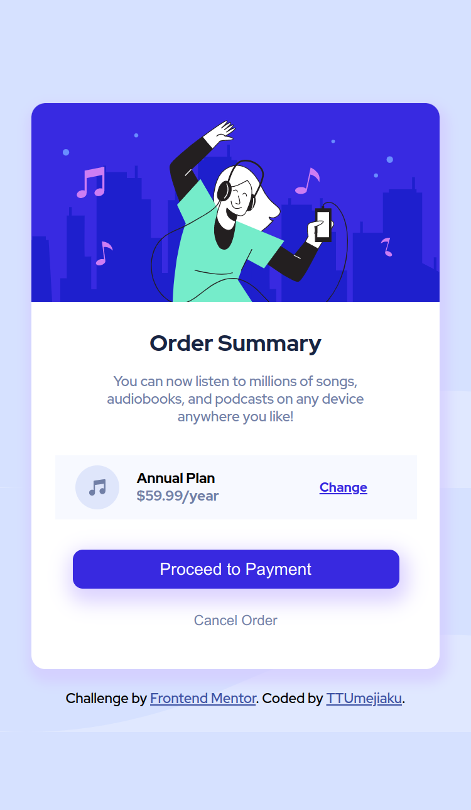

# Frontend Mentor - Order summary card solution

This is a solution to the [Order summary card challenge on Frontend Mentor](https://www.frontendmentor.io/challenges/order-summary-component-QlPmajDUj). Frontend Mentor challenges help you improve your coding skills by building realistic projects.

## Table of contents

- [Overview](#overview)
  - [The challenge](#the-challenge)
  - [Screenshot](#screenshot)
  - [Links](#links)
- [My process](#my-process)
  - [Built with](#built-with)
  - [What I learned](#what-i-learned)
- [Author](#author)
- [Acknowledgments](#acknowledgments)

## Overview

### The challenge

Users should be able to:

- See hover states for interactive elements

### Screenshot




### Links

- Solution URL: (https://github.com/TTUmejiaku/order-summary-component)
- Live Site URL: (https://ttumejiaku-order-summary-component.netlify.app/)

## My process

### Built with

- Semantic HTML5 markup
- CSS custom properties
- Flexbox
- CSS Grid
- Mobile-first workflow

### What I learned

Doing this challenge helped built up my muscle memory regarding how wonderfull positioning: relative & absolute can be. I learnt how to style background image properly.

The css code below was helpful:

```css
.bg-img {
  background-image: url(./images/pattern-background-desktop.svg);
  background-repeat: no-repeat;
  background-position: center;
  background-size: cover;
  position: absolute;
  top: 0;
  left: 0;
  right: 0;
  bottom: 0;
  height: 50vh;
  z-index: -1;
}
```

## Author

- Frontend Mentor - (https://www.frontendmentor.io/profile/ttumejiaku)
- Twitter - (https://www.twitter.com/ttumejiaku)

## Acknowledgments

- tsbsankara - (https://www.youtube.com/c/tsbsankara/about). Helped me understand how to style background images.
